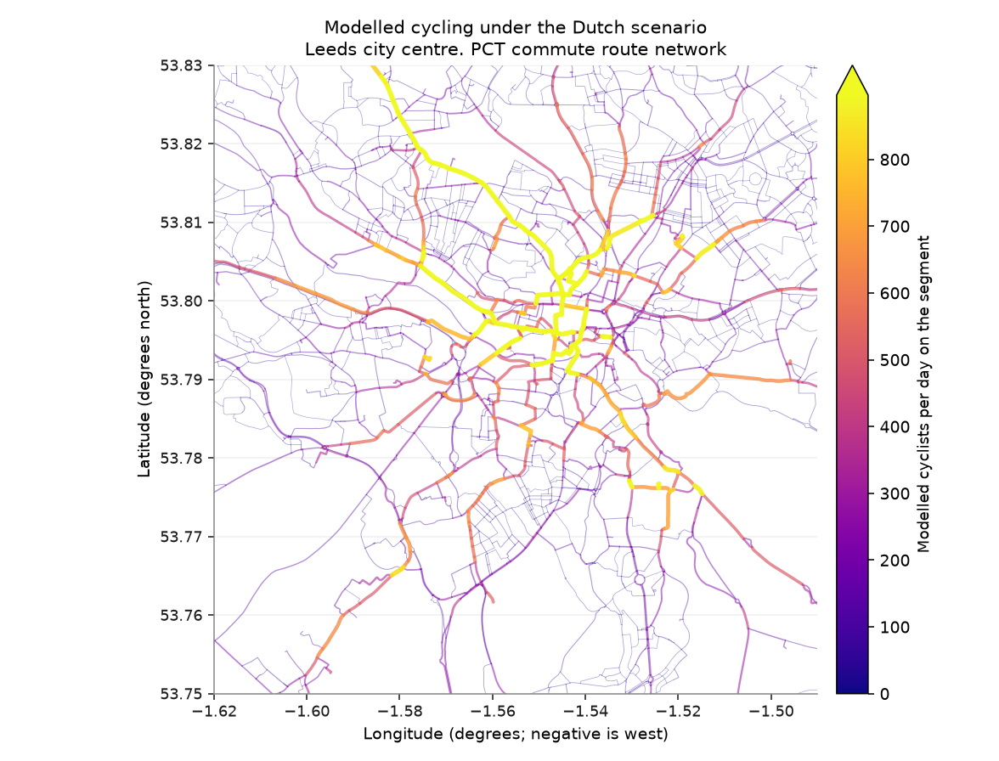
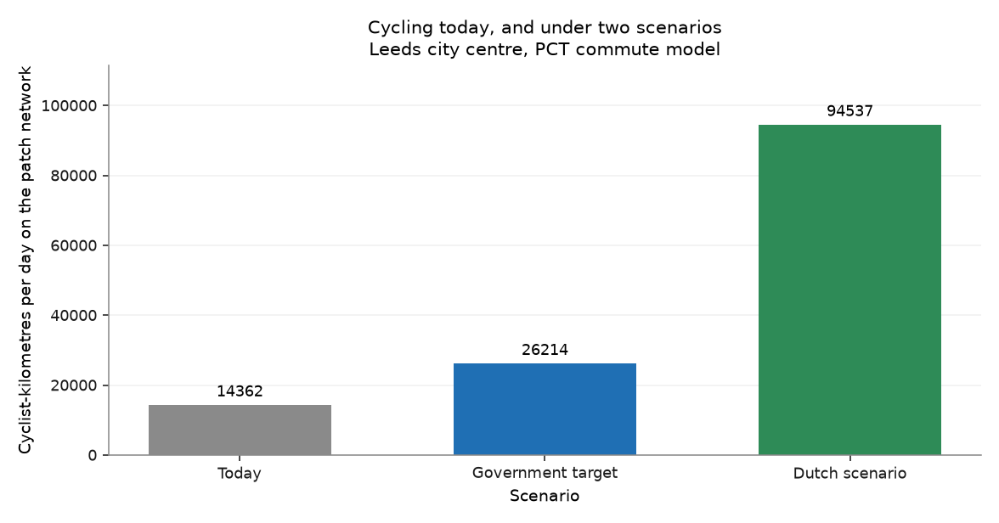
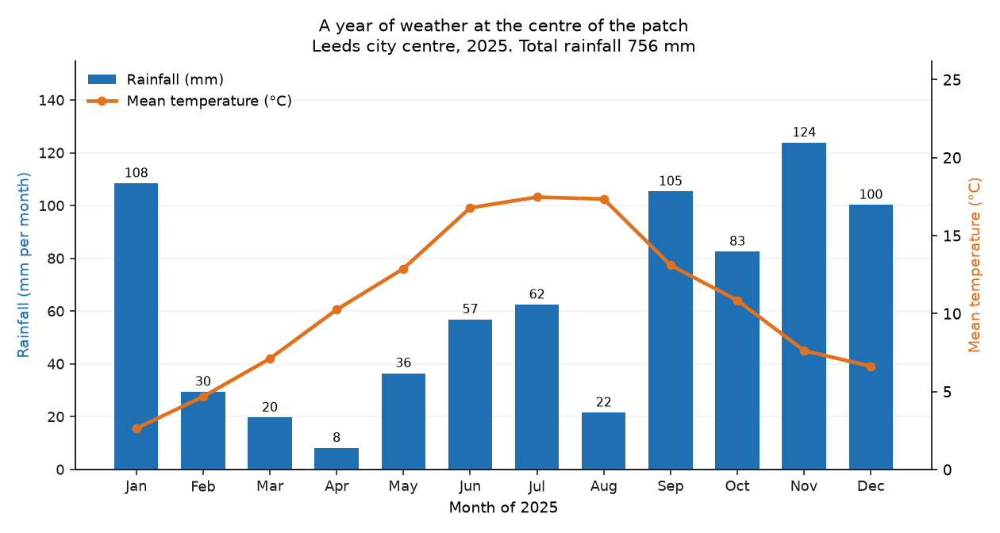
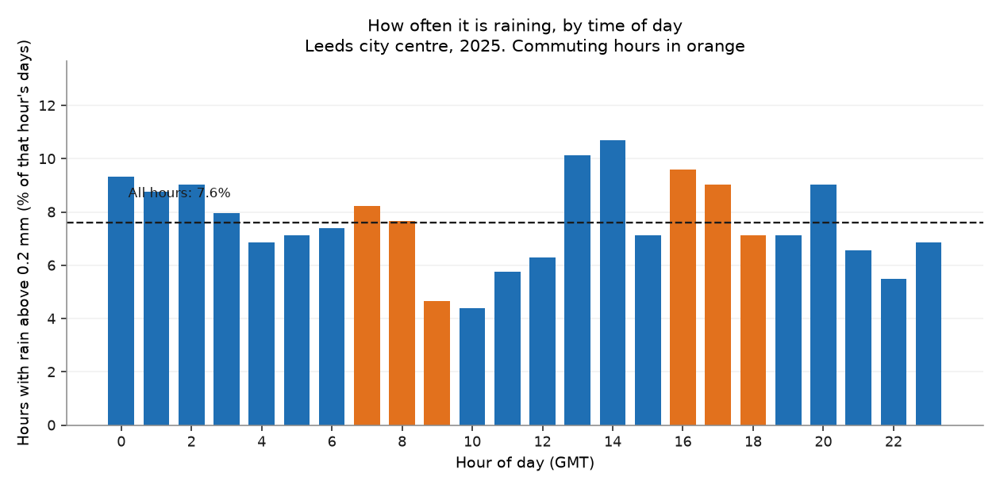

# The atlas

*Leeds city centre*

!!! quote "Written by an AI assistant"

    This page was planned, built and written by Claude. The prose is
    hand-written; every number in it was injected from the computation
    at build time. Rebuilt 2026-08-15 11:42 UTC.

Seven chapters, seven national datasets, one bounding box. This page puts them
next to each other.

Everything below was computed by the chapters. Nothing on this page reads a
file of its own, and no number here was typed by hand — which is the only
reason a summary page is safe to write at all. A summary is where an atlas
usually starts to overclaim, because it is the page furthest from the data.

## The patch

**Leeds city centre**, a box 8.5 km east–west by 8.9 km north–south, covering **76 km²**.

```
south 53.75   west -1.62   north 53.83   east -1.49
```

A rectangle is not a place. This one includes ground nobody would call the city centre, and every figure in the atlas is titled with the box rather than with a claim about where the centre ends.

## Seven numbers

| Chapter | The number | |
|---|---:|---|
| [Stops and stations](chapter-01.md) | **1,328** | public transport access points, 17.5 per km² |
| [Area within 400 m of one](chapter-01.md) | **91.4%** | of the patch, median walk 149 m |
| [Active-mode casualties](chapter-02.md) | **729** | in two years: 15 killed, 244 seriously injured |
| [Neighbourhoods in England's poorest tenth](chapter-03.md) | **42.4%** | against 10% for an average place |
| [Households with no car](chapter-04.md) | **42.6%** | against 23.5% for England and Wales |
| [Cycling under the Dutch scenario](chapter-05.md) | **6.6×** | today's modelled commuter cycling |
| [Everyday destinations near a stop](chapter-06.md) | **100.0%** | of 282 schools, shops, surgeries and campuses |
| [Commuting hours that are wet](chapter-07.md) | **7.7%** | of 07–09 and 16–18, across the whole year |

## What the seven chapters say together

Read on its own, each chapter is a description. Read together, they are an
argument, and it is worth being explicit about how much of it the data
supports.

**42.6% of households in this patch have no car** — 1.8 times the
England and Wales rate. For those households the network in chapter 1 is not a
convenience; it is the entire transport system. That network is dense:
**91.4% of the patch is within 400 m of an access point**, and
**100.0% of everyday destinations** are too.

So access to *something* is close to universal here. What that something is —
how often it runs, where it goes, at what time of night — is not in this
atlas, and it is the question everything above is pointing at.

Meanwhile **729 people were injured walking or cycling** in the
patch over two years. Pedestrians and cyclists appear in roughly equal
numbers, despite very unequal exposure. The modelled cycling potential in
chapter 5 is **6.6× today's level**, and chapter 7 removes the
easiest objection to it: only **7.7% of commuting hours are wet**.

**What this atlas cannot tell you.** Not whether any of it is fair.
Chapters 3 and 4 describe deprivation and car ownership on **different
geographies** and are deliberately never joined, so the obvious question —
are the car-free neighbourhoods also the poorest? — is one this atlas
declines to answer rather than answers badly.

## Every figure

### Chapter 1 — [The patch and its stops](chapter-01.md)


*Every NaPTAN access point in the patch. Bus stops in blue, rail stations starred. The blank areas are the subject of the next figure.*


*Walking distance to the nearest access point, on a 200 m grid. Inside the blue line you are within 400 m of a stop; 91.4% of the patch is.*


*The same information as a curve. The steepness in the first 300 m is what a dense bus network looks like.*

### Chapter 2 — [Road safety](chapter-02.md)


*Every reported pedestrian and cyclist casualty in the patch over two years. Fatalities marked with a cross, at a size that does not let them disappear under the slight injuries.*


*The severity split. Slight injuries dominate every road safety dataset; if they did not, the severity codes would be reversed.*


*Distance from each casualty to the nearest access point from chapter 1, clipped at 400 m. This is correlation, not cause: stops and casualties both cluster where people are.*

### Chapter 3 — [Deprivation](chapter-03.md)


*Where the patch's neighbourhoods sit in England's ranking. The dashed line is what a perfectly average place would look like: 10% in every decile. Anything above the line on the left is over-representation in the most deprived tenth.*


*One point per neighbourhood, placed at its population-weighted centre rather than its geographic middle. Red is the most deprived end of England's range.*

### Chapter 4 — [Who has no car](chapter-04.md)


*How car-free households are distributed across the patch's neighbourhoods, against the England and Wales figure. The spread is the finding: the patch average hides neighbourhoods at both extremes.*


*Car-free households by neighbourhood. Compare this with chapter 1's coverage map: the two together are the argument of the whole atlas.*


*The neighbourhoods where not owning a car is the normal case rather than the exception.*

### Chapter 5 — [Cycling potential](chapter-05.md)



*The commuter cycling network the Dutch scenario implies. Line width and colour both carry the modelled flow, so the corridors are legible in greyscale as well as in colour.*



*Daily cyclist-kilometres across the patch network. Cyclist-kilometres rather than cyclists, because a busy 20 m link and a busy 2 km corridor are not the same amount of cycling.*

### Chapter 6 — [What is there](chapter-06.md)


*Six kinds of everyday destination, over the transport stops from chapter 1 in grey.*


*What the patch contains, by category. These are counts of mapped objects, not of floor space or capacity: one large secondary school and one small primary count the same.*


*Distance from each kind of destination to the nearest stop. The 400 m threshold is not a useful test in this patch, because everything clears it, so the curves show where the categories actually differ. Pharmacies and supermarkets sit on the network; schools sit back from it.*

### Chapter 7 — [A year of weather](chapter-07.md)



*Monthly rainfall and mean temperature. Two scales on one figure, which is only acceptable because both axes are labelled and coloured to match their series.*



*The share of days on which each hour was wet. The flatness is the finding: rain does not avoid the commute, and it does not target it either.*

## Everything this atlas used

| Dataset | Retrieved | Licence |
|---|---|---|
| [NaPTAN access nodes, ATCO area 450 (West Yorkshire)](https://naptan.api.dft.gov.uk/v1/access-nodes?atcoAreaCodes=450&dataFormat=csv) | 2026-08-15 11:42 UTC, live | OGL v3.0, © Crown copyright |
| [NaPTAN access nodes, ATCO area 910 (national rail)](https://naptan.api.dft.gov.uk/v1/access-nodes?atcoAreaCodes=910&dataFormat=csv) | 2026-08-15 11:42 UTC, live | OGL v3.0, © Crown copyright |
| [STATS19 collisions 2022](https://data.dft.gov.uk/road-accidents-safety-data/dft-road-casualty-statistics-collision-2022.csv) | 2026-08-15 11:42 UTC, live | OGL v3.0, © Crown copyright |
| [STATS19 casualties 2022](https://data.dft.gov.uk/road-accidents-safety-data/dft-road-casualty-statistics-casualty-2022.csv) | 2026-08-15 11:42 UTC, live | OGL v3.0, © Crown copyright |
| [STATS19 collisions 2023](https://data.dft.gov.uk/road-accidents-safety-data/dft-road-casualty-statistics-collision-2023.csv) | 2026-08-15 11:42 UTC, live | OGL v3.0, © Crown copyright |
| [STATS19 casualties 2023](https://data.dft.gov.uk/road-accidents-safety-data/dft-road-casualty-statistics-casualty-2023.csv) | 2026-08-15 11:42 UTC, live | OGL v3.0, © Crown copyright |
| [English Indices of Deprivation 2019, File 7](https://assets.publishing.service.gov.uk/government/uploads/system/uploads/attachment_data/file/845345/File_7_-_All_IoD2019_Scores__Ranks__Deciles_and_Population_Denominators_3.csv) | 2026-08-15 11:42 UTC, live | OGL v3.0, © Crown copyright |
| [ONS LSOA 2011 population-weighted centroids](https://services1.arcgis.com/ESMARspQHYMw9BZ9/arcgis/rest/services/LSOA_Dec_2011_PWC_in_England_and_Wales_2022/FeatureServer/0/query?geometry=-1.62,53.75,-1.49,53.83&geometryType=esriGeometryEnvelope&inSR=4326&spatialRel=esriSpatialRelIntersects&outFields=lsoa11cd,lsoa11nm&outSR=4326&returnGeometry=true&f=geojson) | 2026-08-15 11:42 UTC, live | OGL v3.0, © Crown copyright and database right |
| [ONS LSOA 2021 population-weighted centroids](https://services1.arcgis.com/ESMARspQHYMw9BZ9/arcgis/rest/services/LSOA_PopCentroids_EW_2021_V4/FeatureServer/0/query?geometry=-1.62,53.75,-1.49,53.83&geometryType=esriGeometryEnvelope&inSR=4326&spatialRel=esriSpatialRelIntersects&outFields=LSOA21CD&outSR=4326&returnGeometry=true&f=geojson) | 2026-08-15 11:42 UTC, live | OGL v3.0, © Crown copyright and database right |
| [Census 2021 table TS045, car or van availability (Nomis NM_2063_1)](https://www.nomisweb.co.uk/api/v01/dataset/NM_2063_1.data.csv?date=latest&geography=E01011281,E01011283,E01011284,E01011286,E01011292,E01011293,E01011294,E01011295,E01011312,E01011313,E01011314,E01011315,E01011316,E01011317,E01011318,E01011319,E01011320,E01011321,E01011322,E01011324,E01011332,E01011338,E01011339,E01011340,E01011342,E01011344,E01011347,E01011348,E01011349,E01011350,E01011352,E01011353,E01011354,E01011355,E01011356,E01011357,E01011358,E01011359,E01011360,E01011361,E01011362,E01011363,E01011364,E01011366,E01011368,E01011369,E01011370,E01011371,E01011372,E01011373,E01011374,E01011375,E01011421,E01011422,E01011423,E01011424,E01011426,E01011427,E01011428,E01011429,E01011430,E01011431,E01011432,E01011433,E01011434,E01011435,E01011440,E01011441,E01011442,E01011443,E01011444,E01011445,E01011446,E01011447,E01011448,E01011449,E01011450,E01011451,E01011466,E01011467,E01011468,E01011469,E01011470,E01011471,E01011472,E01011473,E01011474,E01011475,E01011476,E01011477,E01011478,E01011479,E01011480,E01011481,E01011482,E01011483,E01011485,E01011488,E01011489,E01011502,E01011518,E01011524,E01011525,E01011526,E01011528,E01011531,E01011532,E01011615,E01011617,E01011618,E01011621,E01011623,E01011625,E01011626,E01011630,E01011642,E01011643,E01011644,E01011645,E01011646,E01011647,E01011648,E01011668,E01011669,E01011670,E01011671,E01011673,E01011677,E01011678,E01011681,E01011690,E01011691,E01011692,E01011693,E01011694,E01011725,E01011729,E01011730,E01011731,E01011732,E01011733,E01011734,E01011735,E01011736,E01011737,E01032493,E01032494,E01032497,E01032499,E01032500,E01032606,E01032607,E01032608,E01032946,E01033002,E01033003,E01033008,E01033010,E01033011,E01033013,E01033015,E01033016,E01033021,E01033031,E01033033,E01033034,E01033035,E01035040,E01035041,E01035042,E01035043,E01035044,E01035045,E01035046,E01035047,E01035054&c2021_cars_5=0,1&measures=20100&select=geography_code,geography_name,c2021_cars_5_name,obs_value) | 2026-08-15 11:42 UTC, live | OGL v3.0, © Crown copyright |
| [Propensity to Cycle Tool, commute route network, west-yorkshire](https://npttile.vs.mythic-beasts.com/commute/v2/west-yorkshire/rnet.geojson) | 2026-08-11, cached copy | OGL v3.0 / see pct.bike |
| [OpenStreetMap amenities via the Overpass API](https://overpass-api.de/api/interpreter) | 2026-08-15 11:42 UTC, live | ODbL 1.0, © OpenStreetMap contributors — attribution required |
| [open-meteo historical archive, hourly, 2025](https://archive-api.open-meteo.com/v1/archive?latitude=53.7900&longitude=-1.5550&start_date=2025-01-01&end_date=2025-12-31&hourly=precipitation,temperature_2m&timezone=GMT) | 2026-08-15 11:42 UTC, live | CC-BY 4.0 — attribution required |

Contains public sector information licensed under the Open Government Licence v3.0. Map data © OpenStreetMap contributors, ODbL. Weather data © open-meteo.com, CC-BY 4.0.
