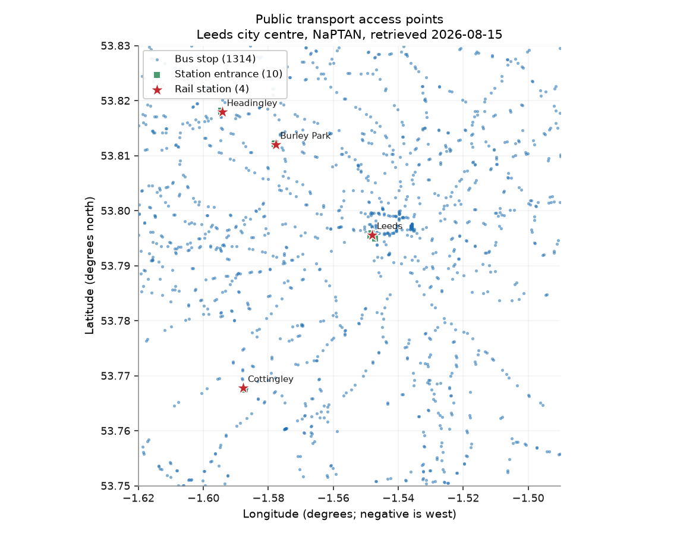
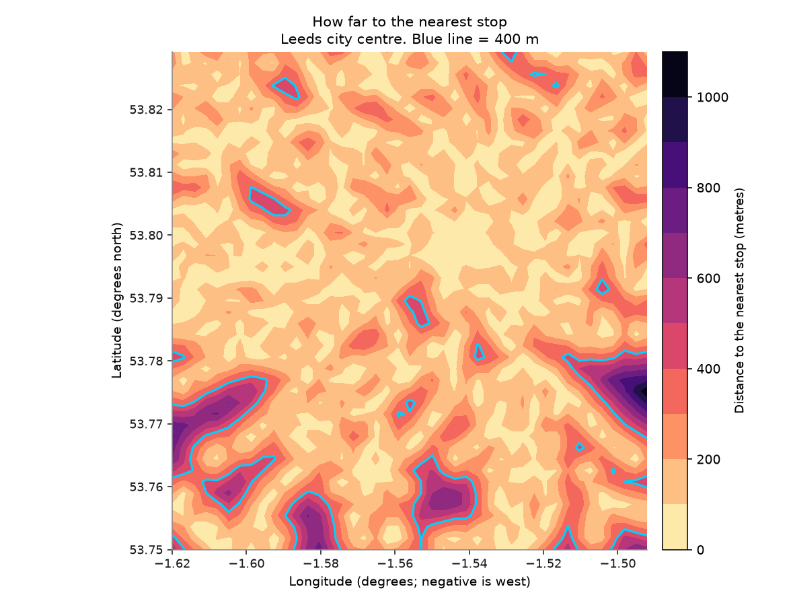
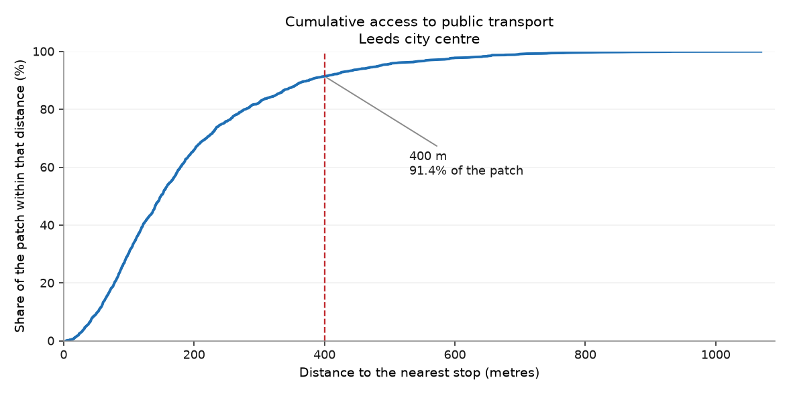

# Chapter 1 — The patch and its stops

*Where can you catch something, and where can you not?*

!!! quote "Written by an AI assistant"

    This page was planned, built and written by Claude. The prose is
    hand-written; every number in it was injected from the computation
    at build time. Rebuilt 2026-08-15 11:42 UTC.

An atlas of public transport has to start by saying where public transport
*is*. That sounds like the easy chapter. It is not, for two reasons that both
show up below: the area code you need is unguessable, and the obvious query
returns an answer that is confidently incomplete.

NaPTAN is the national register of every point at which a passenger can join
a public transport service. It is published per administrative area, and each
area has a three-digit ATCO code. Leeds sits in **West Yorkshire, area 450** —
a number you cannot derive from the name of the place, cannot infer from any
pattern in the other codes, and which I would have got wrong if the repository
had not shipped `data/external/atco_area_codes.csv` with all 150 of them in it.

## The query that looks right and is not

My plan said: fetch ATCO area 450, cut to the box, draw the stops. I ran it,
got **1,314 bus stops**, and the map looked entirely convincing.

Then I ran hand-check 2 — *Leeds Rail Station must be in here* — and it
failed. Not because of a bug. Because **NaPTAN does not put rail stations in
the local authority area at all.** Every railway station in Great Britain
lives in area **910**, a national pseudo-area, and a query for West Yorkshire
returns none of them.

This is the most instructive thing that happened in the whole build, so it is
worth being precise about why it is dangerous:

- Nothing failed. No traceback, no empty table, no zero row count.
- The map looked *better* without the stations, because 1,314 evenly spread
  blue dots look like a complete network.
- Every summary statistic was internally consistent.
- An atlas of public transport in Leeds would have been published with Leeds
  Rail Station missing from it.

The row counts — layer 2 of the quality control — could never have caught
this, because the rows that were missing were never there to be counted. Only
a check anchored outside the data caught it: *a station I know exists is not
in my file.*

## What the patch actually contains

With area 910 added, the patch holds **1,328 access points**: 1,314 bus
stops, 4 rail stations and 10 station entrances. Those three
numbers add to the total, which is a property this chapter had to be forced
to have — see the second correction below.

That is **17.5 stops per km²** over 76 km², which is a dense
network by British standards and unremarkable for a core city.

Density on its own is a poor description, though. It is an average, and an
average over a rectangle tells you nothing about the corner of the rectangle
where nobody can catch anything. So the second figure asks a better question:
**from any point in the patch, how far is the nearest stop?**

A 200 m grid over the box, and a distance from each grid point to the nearest
access point. The answer is that **91.4% of the patch is within
400 m of a stop** — roughly a five-minute walk — with a median distance
of **149 m**.

The worst-served point in the patch is 1069 m from anything, at
53.7752 N, 1.4921 W.

## Degrees are not metres

Every distance on this page is in metres, and getting there took one function
rather than one line.

Coordinates arrive in degrees. At this latitude one degree of latitude is
about **111.1 km**, while one degree of longitude is about **65.7 km**,
because the meridians have converged by 53.8° north. Pythagoras on raw degrees
therefore stretches every east–west distance by a factor of about
**1.69** and produces numbers that are wrong, plausible, and in no
units at all.

`atlaslib.distance_metres` converts both axes before it measures. Hand-check 6,
in chapter 2, tests it against a distance I worked out independently.

## The figures

*Every NaPTAN access point in the patch. Bus stops in blue, rail stations starred. The blank areas are the subject of the next figure.*

*Walking distance to the nearest access point, on a 200 m grid. Inside the blue line you are within 400 m of a stop; 91.4% of the patch is.*

*The same information as a curve. The steepness in the first 300 m is what a dense bus network looks like.*

## What it shows

- The patch contains **1,328 public transport access points** — 1,314 bus stops and 4 rail stations — at 17.5 per km².
- **91.4% of the patch is within 400 m of a stop**, with a median walk of 149 m. Access to *something* is close to universal here.
- The gaps are not distributed evenly: the worst-served point is 1069 m from any access point, which is a fifteen-minute walk before the journey starts.

## Row counts

Every filter and every join in this chapter, with the row count on each side of it. A join that quietly dropped most of the patch would show up here as a percentage, not as an error.

| Operation | Rows before | Rows after | Kept |
|---|---:|---:|---:|
| Drop stops marked inactive | 19,447 | 19,331 | 99.4% |
| Bounding-box filter to the patch | 19,331 | 1,328 | 6.9% |
| Grid cells within 400 m of a stop | 1,935 | 1,769 | 91.4% |

## Hand-checks

| # | The claim | Checked against | Anchored outside the data | Result |
|---|---|---|:---:|:---:|
| 1 | Leeds City Bus Station is in the data | Its real address on Dyer Street (53.7975 N, 1.5372 W) | ⚓ yes | pass |
| 2 | Leeds Rail Station is in the data | It exists, and it is the busiest station in the North outside Manchester | ⚓ yes | pass |
| 3 | Every kept stop is inside the bounding box | The box coordinates themselves | ○ no | pass |
| 4 | Stop density is credible for an English city | A plausible urban range of 5–40 stops per km² | ⚓ yes | pass |
| 5 | Every stop appears in exactly one category on the map | The category counts, summed against the total | ○ no | pass |

**Check 1.** The nearest access point to the real bus station is **Dyer Street** (Leeds City Centre), 71 m away. Anything under about 150 m is the bus station itself or a stand inside it.

**Check 2.** Rail stations found in the patch: Burley Park Rail Station, Cottingley Rail Station, Headingley Rail Station, Leeds Rail Station.

**Check 3.** Tests the filter, not the data. It would pass just as happily on the wrong ATCO area.

**Check 4.** 17.5 stops per km² across 76 km².

**Check 5.** 1,314 bus + 4 rail + 10 other = 1,328, against 1,328 stops. The 'other' category is Rail station entrance (RSE), which the first version of this chapter drew nowhere.

## What this chapter does not say

- A stop is not a service. NaPTAN records where you *could* board, not whether anything stops there, how often, or at what time of day. A stop served twice a day counts the same as one served every four minutes.
- Distance here is straight-line, not walked. Real walking distance is longer wherever a river, a railway or a dual carriageway is in the way — and this patch contains all three.
- The 400 m threshold is a convention, not a finding. It is roughly a five-minute walk on the flat, and Leeds is not flat.

## Where the plan was wrong

!!! failure "Correction to [the plan](plan.md)"

    **Plan §2 said chapter 1 answers "where can you catch something".
    It planned a single query: ATCO area 450.**
    
    Area 450 contains bus stops only. Rail stations are in area 910. The plan
    would have produced a public transport atlas with no railway in it, and
    nothing in the build would have complained.
    
    Fixed by fetching both areas. The hand-check that caught it was written
    *before* the code, in plan §5, which is the only reason it was ever run.

!!! failure "Correction to [the plan](plan.md)"

    **Plan §6 listed "a figure is wrong but the script succeeds" as a
    high risk. It happened on the first figure I drew.**
    
    The first version of the map had two categories, bus and rail. Ten stops in
    the patch are typed `RSE`, a rail station entrance, and belonged to neither.
    They were fetched, they passed the filters, they were counted in every row
    count on this page — and they were drawn nowhere.
    
    Nothing failed. The count of stops was right. The legend added up to ten less
    than the total, which is the only visible trace it left, and I found it by
    reading the legend rather than by any check.
    
    Fixed by making the categories a partition and adding check 5, which asserts
    that they sum to the total. The lesson is the one the risk table already
    predicted: **open the figure and look at it.**

!!! failure "Correction to [the plan](plan.md)"

    **The first coverage map was a broken figure that ran perfectly.**
    
    I set the colour scale to run from 0 to 2,000 m. The largest distance in the
    patch is 1069 m, so about nine tenths of the map came out in the same pale
    yellow and the figure separated nothing.
    
    A colour scale is a claim about the range of your data. This one was a claim
    about a range that does not exist here. Fixed by fitting the levels to the
    data and using a scale with more contrast.

!!! failure "Correction to [the plan](plan.md)"

    **Prediction P1 said the patch would hold between 800 and 1,600
    NaPTAN stops. The answer is 1,328.**
    
    Inside the range, but for the wrong reason: I was predicting bus stops without realising rail was a separate query. The prediction was right and the reasoning behind it was wrong, which is worth less than it looks.
