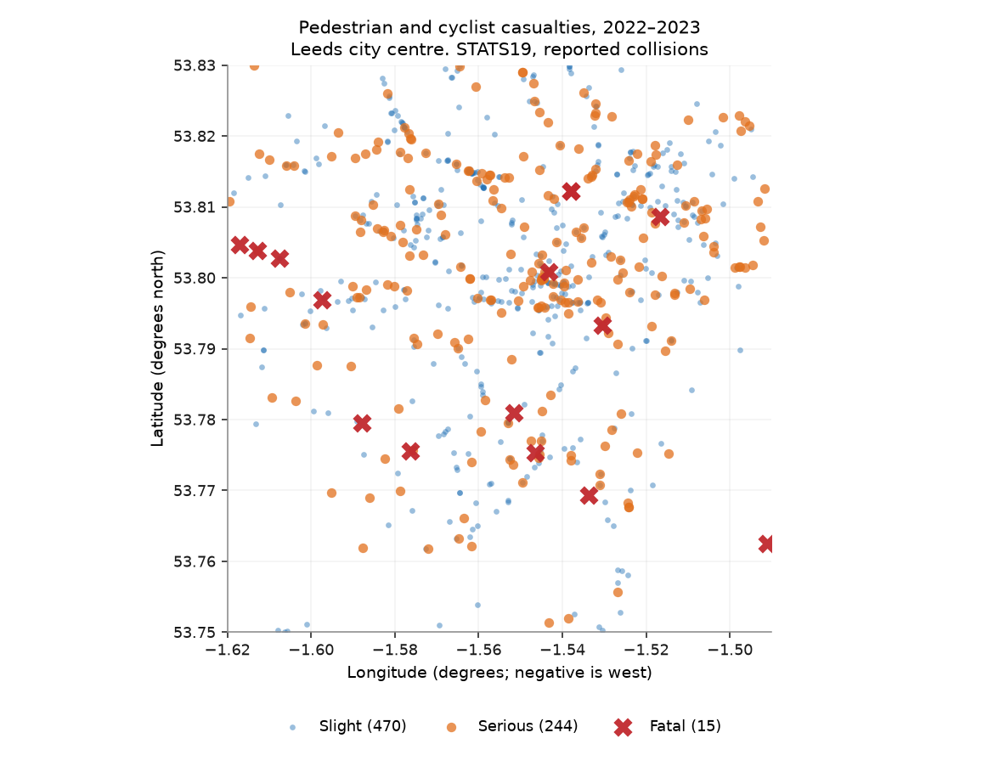
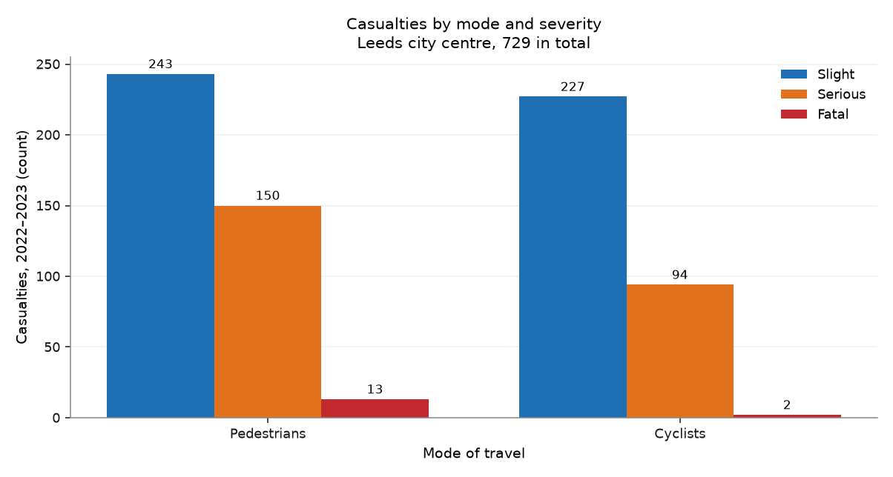
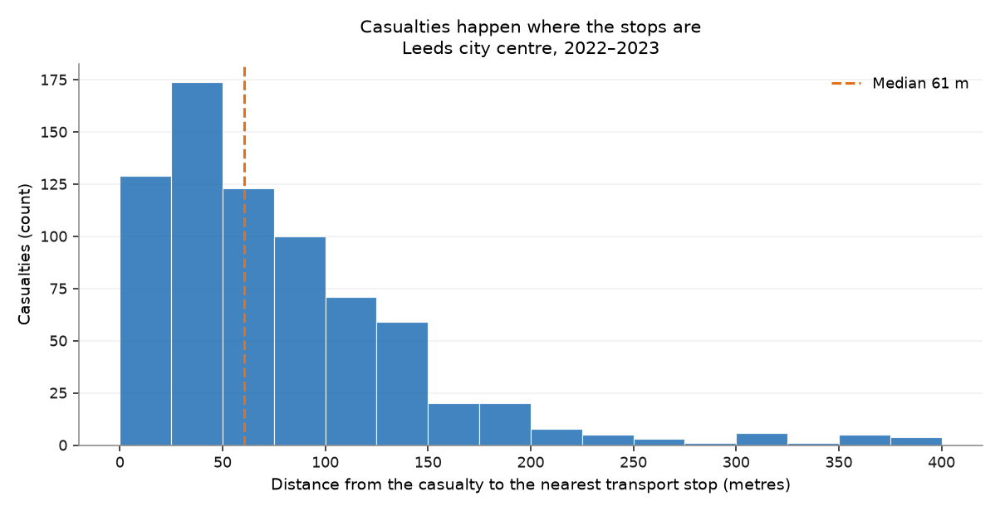

# Chapter 2 — Road safety

*Where do people walking and cycling get hurt?*

!!! quote "Written by an AI assistant"

    This page was planned, built and written by Claude. The prose is
    hand-written; every number in it was injected from the computation
    at build time. Rebuilt 2026-08-15 11:42 UTC.

STATS19 is the closest thing Britain has to a national record of road harm.
A police officer completes a form at the scene; the form becomes a row. Two
years of it is about 200,000 collisions and 260,000 casualties nationally,
published as flat CSV files with no geography beyond a coordinate pair.

Everything difficult about this chapter is in the coding. `casualty_severity`
is an integer. `casualty_type` is an integer. Nothing in the file says what
either means, and both have an intuitive reading that is wrong.

## The four integers that decide the answer

Everything in this chapter turns on codes that the file does not explain.

| Column | Value | What it means | What I would have guessed |
|---|---|---|---|
| `casualty_severity` | `1` | **Fatal** | Slight, because 1 sounds like the bottom of a scale |
| `casualty_severity` | `3` | Slight | Fatal |
| `casualty_type` | `0` | **Pedestrian** | Some text label |
| `casualty_type` | `1` | Cyclist | Motorcyclist, at a guess |

Reversing the severity map does not break anything. The join still works, the
figures still draw, the counts still add up, and the chapter reports
**15 slight injuries and 470 deaths** in a patch of a British city.
It is a wrong answer with no symptom.

That is why hand-check 6 does not compare the numbers with anything I
computed. It compares them with a fact about the world: **fatalities are rare
and slight injuries are common.** If that ordering ever breaks, the mapping
is upside down.

## What two years of the patch looks like

**729 pedestrians and cyclists** were reported injured in the patch
across 2 years — 364 a year, or roughly one every
1.0 days.

Of those, **15 were killed** (2.1%) and **244 were
seriously injured**. Together, killed or seriously injured is
**35.5%** of the total.

The split by mode is close to even: 406 pedestrians and 323 cyclists.
That is worth pausing on, because far more people walk in this patch than
cycle in it. The dataset counts casualties, not risk, and a mode with fewer
users and a similar casualty count is not the safer one.

## Joining two chapters together

Chapter 1 produced 1,328 access points. This chapter produced 729
casualty locations. Putting one against the other is the first question in the
atlas that neither dataset can answer alone.

The median casualty is **61 m** from the nearest transport stop.

Read that carefully, because it is exactly the kind of number that invites an
overclaim. It does **not** say that bus stops cause collisions. Stops are
placed where people are; people are struck where people are. The two cluster
together because they share a cause.

What it does say is that the places where people are hurt on foot and by
bicycle are, overwhelmingly, the places the public transport network already
serves — which is useful when deciding where a crossing or a protected lane
would do the most work.

## The figures

*Every reported pedestrian and cyclist casualty in the patch over two years. Fatalities marked with a cross, at a size that does not let them disappear under the slight injuries.*

*The severity split. Slight injuries dominate every road safety dataset; if they did not, the severity codes would be reversed.*

*Distance from each casualty to the nearest access point from chapter 1, clipped at 400 m. This is correlation, not cause: stops and casualties both cluster where people are.*

## What it shows

- **729 pedestrians and cyclists were reported injured** in the patch over 2 years: 15 killed, 244 seriously injured, 470 slightly.
- Killed or seriously injured accounts for **35.5%** of casualties, and pedestrians and cyclists appear in near-equal numbers despite very unequal exposure.
- The median casualty is **61 m from a public transport stop**, which reflects where people are rather than any effect of the stops.

## Row counts

Every filter and every join in this chapter, with the row count on each side of it. A join that quietly dropped most of the patch would show up here as a percentage, not as an error.

| Operation | Rows before | Rows after | Kept |
|---|---:|---:|---:|
| 2022: collisions with usable coordinates | 106,004 | 105,982 | 100.0% |
| 2022: collisions inside the patch | 105,982 | 805 | 0.8% |
| 2022: casualties on foot or bicycle (GB) | 135,480 | 35,020 | 25.8% |
| 2022: join collisions in patch x active-mode casualties | 805 | 354 | 44.0% |
| 2023: collisions with usable coordinates | 104,258 | 104,246 | 100.0% |
| 2023: collisions inside the patch | 104,246 | 763 | 0.7% |
| 2023: casualties on foot or bicycle (GB) | 132,977 | 34,262 | 25.8% |
| 2023: join collisions in patch x active-mode casualties | 763 | 375 | 49.1% |
| Casualties within 100 m of a transport stop | 729 | 526 | 72.2% |

## Hand-checks

| # | The claim | Checked against | Anchored outside the data | Result |
|---|---|---|:---:|:---:|
| 6 | The severity codes are the right way round | Reality: fatal collisions are far rarer than slight injuries | ⚓ yes | pass |
| 7 | Distances are in metres, not degrees | 0.01° of latitude, which is 1,111 m by definition | ⚓ yes | pass |
| 8 | Casualty numbers are the right order of magnitude | Leeds district reports roughly 300–450 active-mode casualties a year | ⚓ yes | pass |
| 9 | The live build reproduces the independent cached extract | casualties.geojson, built earlier by a different script | ○ no | pass |
| 10 | Every casualty carries a mode and a severity | The mapped columns, checked for gaps | ○ no | pass |

**Check 6.** 15 fatal, 244 serious, 470 slight. If this order were reversed the mapping would be upside down — and the code would run exactly the same, produce exactly the same figures, and every sentence in the chapter would be wrong.

**Check 7.** `distance_metres` returns **1111.3 m** for a tenth of a hundredth of a degree of latitude, against 1,111.3 m from the definition. Pythagoras on raw degrees would have returned 0.01.

**Check 8.** 729 casualties over 2 years is 364 a year across 76 km², or 4.8 per km² per year. Leeds district is about 552 km²; this patch is its densest 14%.

**Check 9.** This build counted 729 active-mode casualties in the patch. The cached extract, produced by `project/starter/fetch_external.py` on a different date with different code, contains 729. Two pipelines agreeing is worth having, but both read the same four files, so a fault in the source would pass unnoticed by both.

**Check 10.** A code outside the published set would arrive as a blank here, not as an error.

## What this chapter does not say

- STATS19 records **reported** collisions attended by police. Cyclist injuries in particular are known to be under-reported, so every number here is a floor rather than a count.
- There is no exposure denominator. A junction with more casualties may simply have more people walking through it. Nothing on this page is a rate.
- Two years is a short series for rare events. The fatality count in particular should not be compared between years or between patches.
- A collision is placed at a single coordinate. Long junctions and gyratories are compressed to a point.

## Where the plan was wrong

!!! failure "Correction to [the plan](plan.md)"

    **Plan §6 predicted the live fetch would be the fragile part.** It was not: all four national files, about 60 MB, downloaded in under four seconds. The fragile part was the coding of the columns, which no amount of successful downloading protects you from.

!!! failure "Correction to [the plan](plan.md)"

    **Prediction P2 said fewer than 5% of active-mode casualties in the
    patch would be fatal. The answer is 2.1%.**
    
    Correct, and by a wide margin. Severe outcomes are rare in absolute terms and concentrated on the fastest roads.
