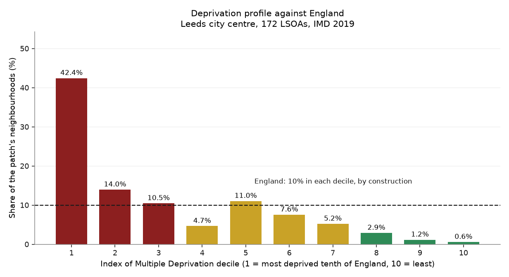
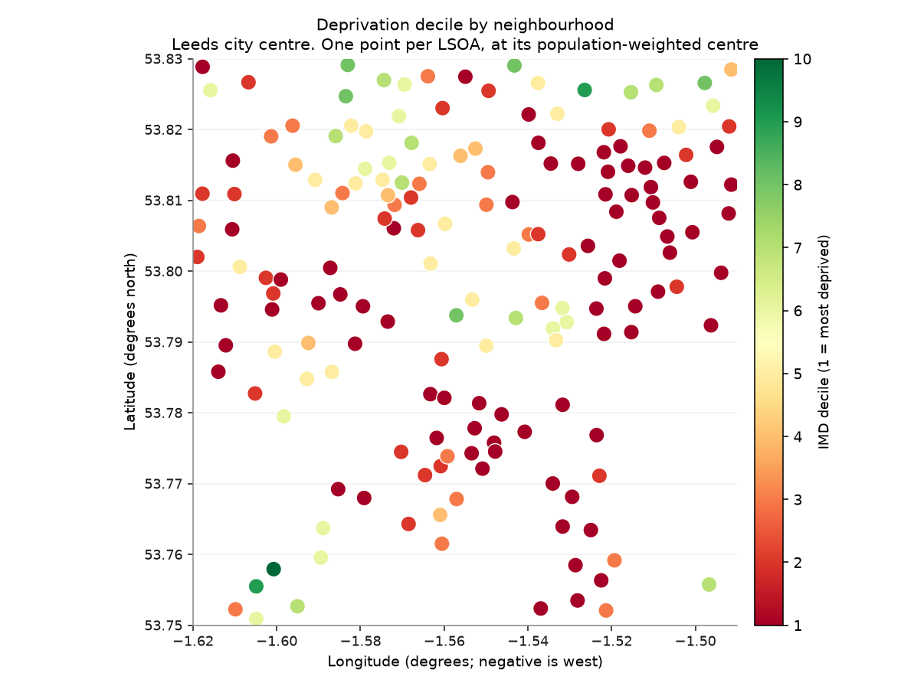

# Chapter 3 — Deprivation

*How poor is this patch, against England as a whole?*

!!! quote "Written by an AI assistant"

    This page was planned, built and written by Claude. The prose is
    hand-written; every number in it was injected from the computation
    at build time. Rebuilt 2026-08-15 11:42 UTC.

The Indices of Multiple Deprivation combine income, employment, education,
health, crime, housing and environment into one rank for every Lower-layer
Super Output Area in England — about 1,500 people each.

The rank is the point. An IMD score of 20.5 means nothing on its own. Knowing
that it places a neighbourhood in the most deprived fifth of England means a
great deal. The whole dataset is an instrument for comparison, and using it
without the comparison throws away the only thing it measures.

## Decile 1 is the poor end

The column is named, in full, *"Index of Multiple Deprivation (IMD) Decile
(where 1 is most deprived 10% of LSOAs)"*. The convention is written into the
header, which is unusually generous of the publisher, and it is still the
thing most often reversed.

The reason it gets reversed is that it reads backwards. Bigger numbers usually
mean more of the thing being measured. Here, **decile 1 is the most deprived
tenth of England** and decile 10 is the least.

Reversing it does not break anything. Every figure draws, every count is
right, and the chapter states the opposite of the truth about a real place
where real people live. Hand-check 10 therefore does not trust the column
name: it compares the IMD *score* of the low-decile areas against the
high-decile ones and confirms the direction from the data itself.

## The vintage trap

IMD 2019 is published against **2011** LSOA boundaries. The Census 2021 table
in the next chapter uses **2021** boundaries. Both are seven-character codes
beginning `E01`. Neither file mentions the other's existence.

Joining across them produces a table. Not an error — a table, with fewer rows
than you started with and no indication of which rows went missing or why.

So this chapter fetches the **2011** centroid file, and chapter 4 fetches the
**2021** one, and the two chapters are never joined to each other. The join
here matched **172 of 172 centroids (100.0%)**, which is what a
correct vintage looks like.

## What the patch looks like

The patch contains **172 neighbourhoods** with a deprivation score.

**42.4% of them are in England's most deprived tenth**, against the 10%
you would see in a perfectly average place. The most deprived three deciles
together account for **66.9%** of the patch, against 30% nationally.

The median neighbourhood here sits in **decile 2**.

The map is the more useful of the two figures, because the profile is not
spatially even. This patch contains some of England's most deprived
neighbourhoods and some of its least, within about three kilometres of each
other.

## The figures

*Where the patch's neighbourhoods sit in England's ranking. The dashed line is what a perfectly average place would look like: 10% in every decile. Anything above the line on the left is over-representation in the most deprived tenth.*

*One point per neighbourhood, placed at its population-weighted centre rather than its geographic middle. Red is the most deprived end of England's range.*

## What it shows

- **42.4% of the patch's 172 neighbourhoods sit in England's most deprived tenth**, against 10% for an average place.
- The most deprived three deciles account for **66.9%** of the patch, against 30% nationally.
- Deprivation here is not evenly spread: the map holds neighbourhoods from both ends of England's range within a few kilometres.

## Row counts

Every filter and every join in this chapter, with the row count on each side of it. A join that quietly dropped most of the patch would show up here as a percentage, not as an error.

| Operation | Rows before | Rows after | Kept |
|---|---:|---:|---:|
| LSOA centroids returned, then filtered to the box | 174 | 172 | 98.9% |
| Join LSOA centroids x IMD 2019 on 2011 codes | 172 | 172 | 100.0% |

## Hand-checks

| # | The claim | Checked against | Anchored outside the data | Result |
|---|---|---|:---:|:---:|
| 11 | Decile 1 really is the most deprived, not the least | The IMD score itself, which rises with deprivation | ⚓ yes | pass |
| 12 | The 2011-code join did not silently drop the patch | Matched rows against centroids in the box | ○ no | pass |
| 13 | Deciles cover the full 1–10 range as published | The set of distinct decile values found | ○ no | pass |

**Check 11.** Mean IMD score in deciles 1–2: **52.8**. In deciles 9–10: **6.1**. Higher score means more deprived, so decile 1 is the deprived end. Reverse this and every sentence in the chapter inverts while every figure still draws.

**Check 12.** 172 of 172 centroids matched an IMD row: **100.0%**. A join against the *2021* centroid file would have matched far fewer, and produced a thinner map rather than an error.

**Check 13.** Distinct deciles present: 1, 2, 3, 4, 5, 6, 7, 8, 9, 10.

## What this chapter does not say

- IMD 2019 is a **relative rank**, not a measure of poverty. A decile says where a neighbourhood sits among all English neighbourhoods, and nothing about how much better or worse it has become.
- The data is from 2019 and the boundaries from 2011. This is the current publication, and it is old.
- An LSOA holds about 1,500 people. A single deprived neighbourhood contains people at every income; the decile describes the area, not anybody in it.
- A population-weighted centroid is a point standing in for a polygon. An LSOA whose centre falls just outside the box is excluded entirely, even if most of it is inside.

## Where the plan was wrong

!!! failure "Correction to [the plan](plan.md)"

    **Plan §6 rated "a live source is down" as a moderate risk. It
    happened on the very first address I tried.**
    
    The IMD 2019 File 7 link on the current gov.uk publication page returns 404.
    The file is still served from the older attachment path, which is what this
    chapter uses. Had I not checked, the chapter would have fallen back to the
    cached Leeds-district extract without comment, and the atlas would have
    reported the right numbers from a file dated months ago while appearing to be
    live.
    
    That is why the provenance table on every page states **live** or **cached
    copy** rather than just naming the source.

!!! failure "Correction to [the plan](plan.md)"

    **Prediction P3 said more than 10% of the patch's LSOAs would be in
    decile 1. The answer is 42.4%.**
    
    Correct. In a core city patch this is close to unavoidable, which makes it a weak prediction rather than a good one.
