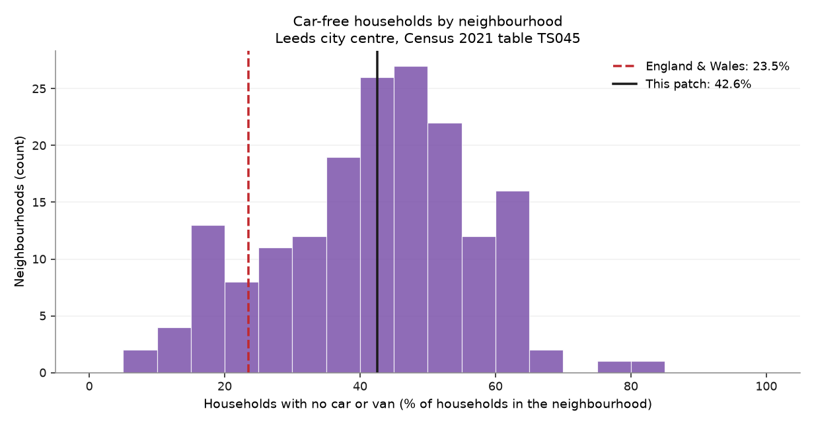
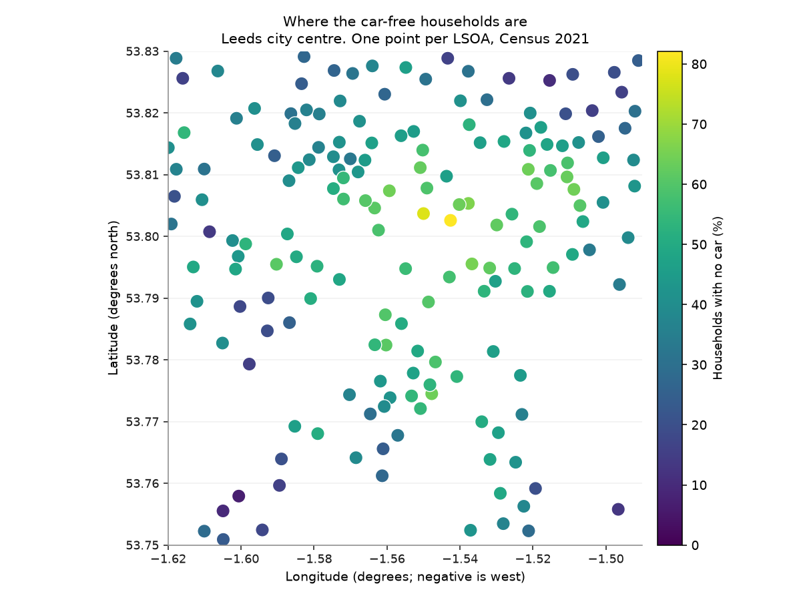
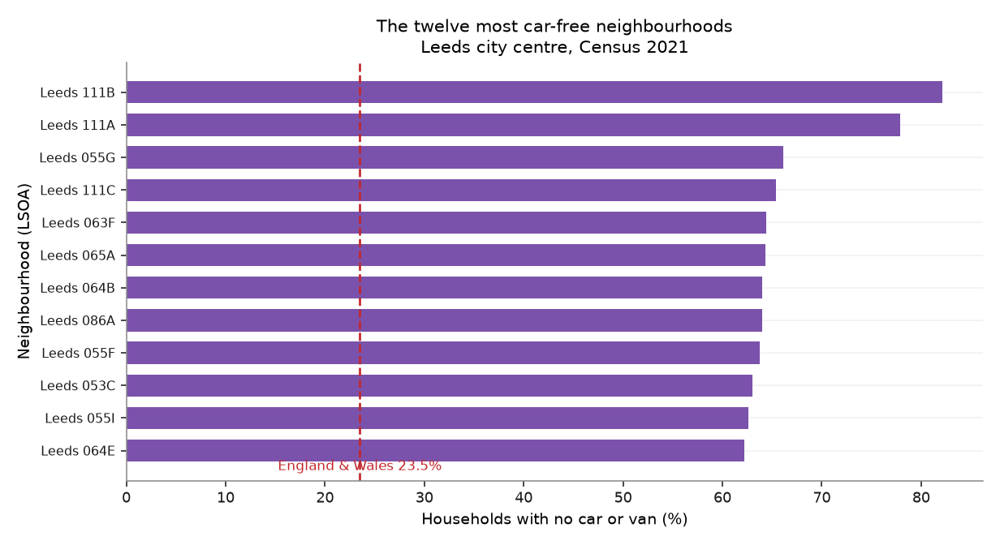

# Chapter 4 — Who has no car

*How many households have no car, and where are they?*

!!! quote "Written by an AI assistant"

    This page was planned, built and written by Claude. The prose is
    hand-written; every number in it was injected from the computation
    at build time. Rebuilt 2026-08-15 11:42 UTC.

Every other chapter describes the network. This one describes the people who
have no alternative to it.

Census 2021 asked every household how many cars or vans it had available.
Table TS045 publishes the answer for every neighbourhood in England and Wales.
A household with none of them walks, cycles, takes the bus, or does not go.

## The number the rest of the atlas is about

**53,366 of the patch's 125,373 households have no car or
van.** That is **42.6%**, against **23.5% for England and Wales** —
about **1.8 times** the national rate.

For those households, chapters 1, 5 and 6 are not a convenience. The bus
network is the car. The 400 m coverage figure in chapter 1 is a description of
their front door. The casualties in chapter 2 are disproportionately theirs,
because walking is what you do when there is no alternative.

The spread matters as much as the average. Neighbourhood shares in this patch
run from **6.9%** to **82.1%**, with a median of **42.5%**.
The most car-free neighbourhood is *Leeds 111B*, where not owning a car is the
normal case rather than the exception.

## The query that gives you a third of the country

The natural way to ask Nomis for this table is `geography=TYPE151`, meaning
every LSOA in England and Wales. It returns a valid CSV, with a header, with
sensible numbers in it.

It contains exactly **25,000 rows**. There are **71,344**. The API has a
default record cap, the response does not mention it, and nothing in the file
indicates that it stops partway through the alphabet.

Had this patch been in a place whose codes sort later than the cut-off, the
chapter would have joined a complete set of centroids against an incomplete
set of statistics and reported the neighbourhoods that survived. The row
counts on this page would all have been internally consistent.

This chapter therefore fetches the geography first and asks for statistics on
**exactly the 176 areas it needs**. That is faster, and more importantly it
turns a silent truncation into an impossible one: if a code is missing from
the response, the join count drops and hand-check 15 fails.

## The join this chapter refuses to make

The obvious next question is whether the car-free neighbourhoods are the
deprived ones. Chapter 3 has a decile for every neighbourhood. This chapter
has a percentage for every neighbourhood. Both are keyed by a seven-character
code beginning `E01`. Joining them is one line.

**That line is not in this chapter, and it will not be.**

Chapter 3's codes are **2011** LSOAs, because IMD 2019 is published against
2011 boundaries. This chapter's are **2021** LSOAs, because Census 2021 is
published against 2021 boundaries. Between the two censuses, ONS split
neighbourhoods that grew and merged ones that shrank. Codes were retired and
new ones issued.

A merge across them does not fail. It returns the rows where a 2011 code
happens to still exist in 2021, drops everything else without a word, and
hands you a scatter plot of deprivation against car ownership that looks
entirely publishable.

The honest way to make that comparison is a lookup table published by ONS
that maps one vintage to the other, with a flag for split, merged and
unchanged areas. That is a piece of work in itself, and it is not something to
do by assuming two columns match because they are the same shape.

## The figures

*How car-free households are distributed across the patch's neighbourhoods, against the England and Wales figure. The spread is the finding: the patch average hides neighbourhoods at both extremes.*

*Car-free households by neighbourhood. Compare this with chapter 1's coverage map: the two together are the argument of the whole atlas.*

*The neighbourhoods where not owning a car is the normal case rather than the exception.*

## What it shows

- **42.6% of households in the patch have no car** — 53,366 of 125,373 — against 23.5% for England and Wales.
- Neighbourhood shares run from **6.9% to 82.1%**, so the patch average describes almost none of its neighbourhoods.
- These households are the population the rest of the atlas is about: the network in chapters 1 and 5 is their only network.

## Row counts

Every filter and every join in this chapter, with the row count on each side of it. A join that quietly dropped most of the patch would show up here as a percentage, not as an error.

| Operation | Rows before | Rows after | Kept |
|---|---:|---:|---:|
| LSOA 2021 centroids returned, then filtered to the box | 177 | 176 | 99.4% |
| Join LSOA 2021 centroids x TS045 on 2021 codes | 176 | 176 | 100.0% |
| 2021 codes that also exist as 2011 codes (the join that must not happen) | 176 | 166 | 94.3% |

## Hand-checks

| # | The claim | Checked against | Anchored outside the data | Result |
|---|---|---|:---:|:---:|
| 14 | The car-free share is credible for a dense city centre | The published England and Wales figure of 23.5% | ⚓ yes | pass |
| 15 | Percentages are of households, not of people | Each neighbourhood's no-car count against its stated total | ○ no | pass |
| 16 | The statistics request was not silently truncated | The number of areas asked for against the number returned | ○ no | pass |
| 17 | The 2021-code join matched the patch | Matched rows against centroids in the box | ○ no | pass |
| 18 | Chapters 3 and 4 use genuinely different geographies | The 2011 codes from chapter 3, intersected with these 2021 codes | ○ no | pass |

**Check 14.** The patch is **42.6%** car-free against **23.5%** for England and Wales — 1.8 times the national rate. A core city patch below the national figure would mean the numerator and denominator had been swapped.

**Check 15.** 125,373 households in the patch, of which 53,366 have no car. No neighbourhood reports more car-free households than households, which it would if the two columns were different populations.

**Check 16.** Asked for 176 areas, received 176. The obvious query — every LSOA in England and Wales — returns exactly 25,000 rows, which is the API's default cap and about a third of the 71,344 that exist. It arrives as a valid CSV with no warning of any kind.

**Check 17.** 176 of 176 centroids matched a TS045 row (100.0%).

**Check 18.** Only **166 of 176** 2021 codes in this patch (94.3%) also exist as 2011 codes. Joining chapter 3 to chapter 4 on these codes would therefore lose about **5.7%** of the patch — silently, as a smaller table, with no error anywhere.

## What this chapter does not say

- Census 2021 was taken in March 2021, during a national lockdown. Student and shared-household areas in particular may not reflect a normal year.
- No car is not the same as no access to one. A household may borrow, hire, or use a car club.
- This is a count of households, not of people. Car-free households are smaller on average, so the share of *people* with no car differs.
- The comparison with deprivation in chapter 3 is deliberately absent. The geographies are different vintages and joining them would be wrong in a way that produces a convincing figure.

## Where the plan was wrong

!!! failure "Correction to [the plan](plan.md)"

    **Prediction P4 said car-free households in the patch would exceed
    40%. The answer is 42.6%.**
    
    Correct.

!!! failure "Correction to [the plan](plan.md)"

    **Prediction P8 said a 2011↔2021 LSOA join would match less than
    95% of rows. The measured overlap is 94.3%.**
    
    Correct, and worse than I expected. A join that loses 6% of a patch is not a rounding error, and nothing in pandas would have told me.
