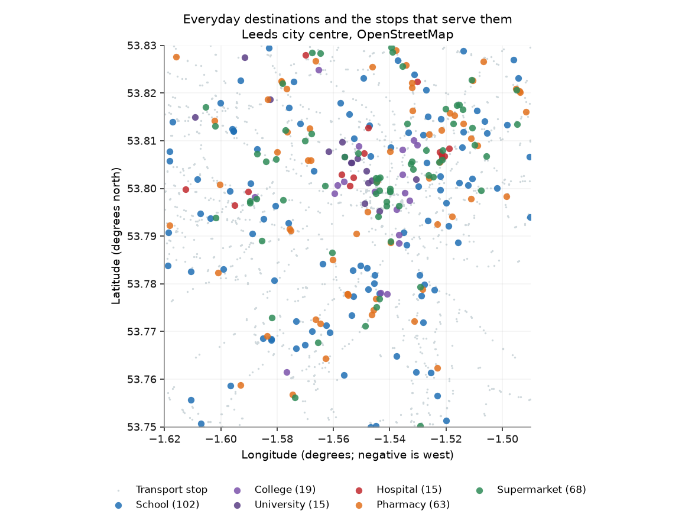
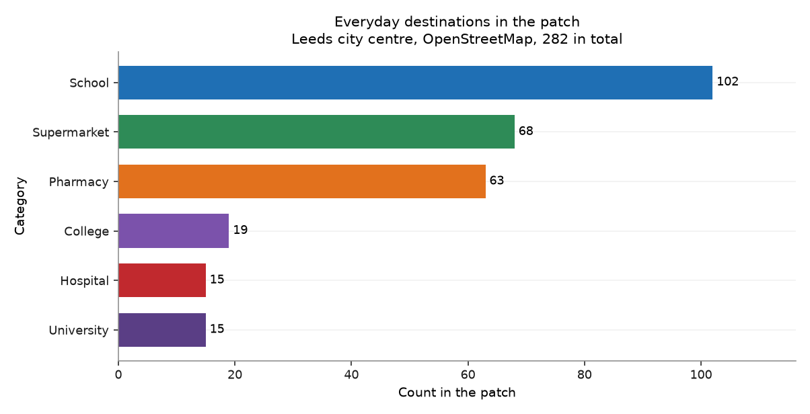
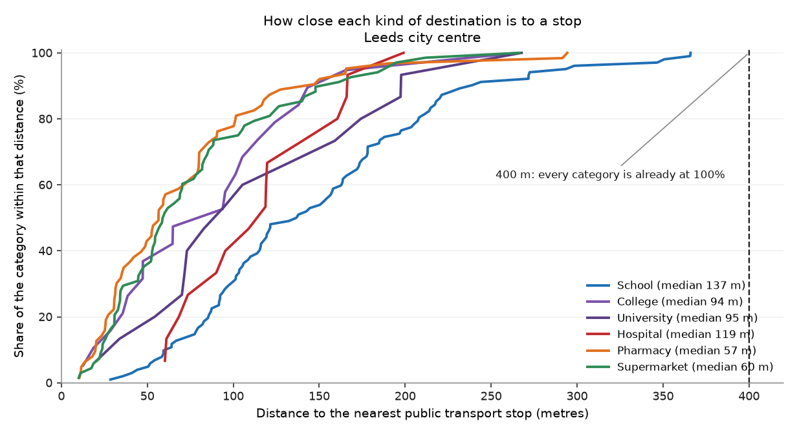

# Chapter 6 — What is there

*What is within reach of a stop?*

!!! quote "Written by an AI assistant"

    This page was planned, built and written by Claude. The prose is
    hand-written; every number in it was injected from the computation
    at build time. Rebuilt 2026-08-15 11:42 UTC.

A stop with nothing near it is a stop nobody uses. This chapter puts the two
halves together: the destinations people actually travel to, and how many of
them the network in chapter 1 reaches.

OpenStreetMap is not an official dataset. It is a volunteered map, which means
its coverage varies by how interested local mappers are. In a British city
centre that coverage is very good — and "very good" is not "complete", which
is a different claim from anything else in this atlas.

## Three ways to be refused

Overpass rejected this chapter three times before it returned anything, and
each refusal looked like a different problem from the one it was.

**1. It is a POST, not a GET.** The query goes in the *body* of the request,
not in the URL. Sending it as a GET is the natural first attempt.

**2. It refuses the default client.** With `requests`' own User-Agent,
Overpass answers **`406 Not Acceptable`** — an HTTP status that reads like a
malformed query. It is not: the server is declining an unidentified client.
Setting a User-Agent that names the project and gives a contact fixes it
instantly, and no amount of adjusting the query ever would. This one cost the
most time, because every instinct says a 406 is your fault for asking badly.

**3. `amenity` and `shop` are different keys.** Schools, colleges,
universities, hospitals and pharmacies are `amenity`. Supermarkets are `shop`.
A query that assumes one key returns five full categories and one empty one —
and an empty category reads as "there are none here" rather than as a bug.

## What the patch holds

**282 everyday destinations** in six categories:

| Category | Count |
|---|---:|
| Schools | 102 |
| Supermarkets | 68 |
| Pharmacies | 63 |
| Colleges | 19 |
| Universities | 15 |
| Hospitals | 15 |

These are counts of mapped objects, and an object is not a measure of size. A
2,000-pupil secondary school and a 200-pupil primary are both one school. A
hospital site with fifteen buildings may be one object or fifteen depending on
how it was mapped.

## What the network reaches

**100.0% of these destinations are within 400 m of a public
transport stop.** Every single one. The furthest is 366 m away.

That is a real answer and a **useless test**. A threshold everything passes
has told you nothing, and the first version of the figure below made it
unmissable: six bars, all at 100%, neatly arranged.

So the question has to be sharpened. Not *does the network reach these places*,
which is settled, but *how close does it get, and to what*:

| | Within 100 m | Within 200 m | Median |
|---|---:|---:|---:|
| All destinations | 55% | 89% | 91 m |

By category the differences are real. Supermarkets and pharmacies sit at a
median of about 60 m — they are *on* the network, because shops and
bus routes both follow high streets. Schools sit further back, at a median of
137 m, because schools are built where there is land.

Compare this with chapter 1, which found 91% of the *area* within
400 m of a stop. Area coverage counts empty ground equally; this counts
destinations. A network can serve most of the map and still miss the hospital.
This one does not — but that had to be measured rather than assumed.

## The figures

*Six kinds of everyday destination, over the transport stops from chapter 1 in grey.*

*What the patch contains, by category. These are counts of mapped objects, not of floor space or capacity: one large secondary school and one small primary count the same.*

*Distance from each kind of destination to the nearest stop. The 400 m threshold is not a useful test in this patch, because everything clears it, so the curves show where the categories actually differ. Pharmacies and supermarkets sit on the network; schools sit back from it.*

## What it shows

- The patch contains **282 everyday destinations** across six categories, dominated by 102 schools and 68 supermarkets.
- **100.0% of them are within 400 m of a public transport stop**, so the network reaches the places people go, not only the ground they stand on.
- OpenStreetMap coverage in a British city centre is good but volunteered: absence here is weaker evidence than presence.

## Row counts

Every filter and every join in this chapter, with the row count on each side of it. A join that quietly dropped most of the patch would show up here as a percentage, not as an error.

| Operation | Rows before | Rows after | Kept |
|---|---:|---:|---:|
| Overpass elements, then those in the six categories | 287 | 287 | 100.0% |
| Bounding-box filter to the patch | 287 | 282 | 98.3% |
| Amenities within 400 m of a transport stop | 282 | 282 | 100.0% |

## Hand-checks

| # | The claim | Checked against | Anchored outside the data | Result |
|---|---|---|:---:|:---:|
| 22 | Both Leeds universities appear in the amenities | They exist, and both have campuses inside this box | ⚓ yes | pass |
| 23 | Amenity counts are plausible for a city of this size | A city-centre patch should hold dozens of schools, not two or two thousand | ⚓ yes | pass |
| 24 | The 400 m access threshold is applied in metres | The same conversion tested in chapter 2 against a known distance | ○ no | pass |

**Check 22.** University of Leeds found: **yes**. Leeds Beckett found: **yes**. 15 universities and 19 colleges in total. If either were missing, the tag list or the bounding box would be wrong — and the map would still look full.

**Check 23.** 102 schools, 68 supermarkets, 63 pharmacies, 15 hospitals.

**Check 24.** 100.0% of amenities are within 400 m of a stop. In raw degrees the threshold would be 400 degrees and the answer would be 100%.

## What this chapter does not say

- OpenStreetMap is crowd-sourced. A missing object may not exist, or may simply not have been mapped. Presence is strong evidence; absence is weak evidence.
- Counts are of objects, not of capacity. Nothing here weights a destination by how many people use it.
- Areas are reduced to their centre point, so a large hospital or campus is measured from the middle rather than from its entrance.
- Six categories is a choice, and it leaves out workplaces, parks, places of worship, libraries and everything else people travel to.

## Where the plan was wrong

!!! failure "Correction to [the plan](plan.md)"

    **Prediction P6 said more than 80% of amenities would be within
    400 m of a stop. The answer is 100.0%.**
    
    Correct, and worthless. Every destination in the patch clears 400 m, so the prediction could not have failed whatever the data said. A prediction that cannot fail is not a prediction — and the figure I first drew from it, six bars all at 100%, is what a metric with no discrimination looks like once you open the picture.
